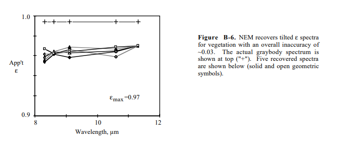

<link rel="stylesheet" href="/algorithms/algorithm.css">

  <a href="/" class="alg-back" aria-label="Back to home">←</a>

  <header class="alg-hero">
    <h1>NEM</h1>
    
Normalized Emissivity Method

  </header>

  <section class="alg-meta">
    
<strong>Authors</strong>: Gillespie, A. R.

    
    
<strong>Date</strong>: 1985

  </section>

  <section class="alg-section alg-narrow">
    

  The Normalized Emissivity Method (NEM) is used to estimate land surface temperature and spectral emissivity from thermal imagery, particularly in cases where prior knowledge of material emissivity is unavailable. This method enables reliable retrievals of surface temperature and emissivity even when only a limited number of thermal bands are available.

  The approach is based on the assumption that within the set of thermal bands, at least one band exhibits the maximum emissivity (<strong>εmax</strong>).
  From this reference band, the <strong>brightness temperature</strong> is estimated using the inverse of Planck’s law, which serves as the basis for deriving the kinetic temperature and emissivity of the remaining pixels.

   

  

  <h3 style="margin:1rem 0 0.5rem">Brightness Temperature</h3>
  

  The brightness temperature (<strong>Tb</strong>) can be derived from the
  measured spectral radiance (<strong>Lλ</strong>) using the inverse of Planck’s law:
  

  
  

  \( T_b = \dfrac{c_2}{\lambda \,\ln\!\left(1 + \dfrac{c_1}{\lambda^5 L_\lambda}\right)} \), 
  where \(c_1 = 2hc^2\) and \(c_2 = \dfrac{hc}{k}\).
  

   
  

  <!-- Contenedor donde irá el gráfico -->
  

  

  <!-- Controles interactivos -->
  

    <label for="tempRange" style="font-weight:600; font-size:0.95rem;">Surface Temperature (K):</label> 
    <input 
      type="range" 
      id="tempRange" 
      min="300" 
      max="2000" 
      value="300" 
      step="1"
      style="width:350px; accent-color:#ff0000; vertical-align:middle;">
    
300 K

  

  
  
  

  Once the kinetic temperature (<strong>Tk</strong>) has been identified as the highest
  brightness temperature, the next step is to estimate the spectral emissivity
  (<strong>εi</strong>) for each band or pixel.
  Using the measured spectral radiance (<strong>Li</strong>), the emissivity can be derived
  from Planck’s radiance function at the kinetic temperature as:

  \[
    \varepsilon_i = \frac{L_i}{B(\lambda, T_k)}
  \]

  Here, \(B(\lambda, T_k)\) represents the blackbody spectral radiance computed from Planck’s law
  for the wavelength \( \lambda \) and kinetic temperature \( T_k \).
  This normalization step ensures that emissivity values remain consistent across all thermal bands.

  With both the kinetic temperature (<strong>Tk</strong>) and the emissivity values
  (<strong>εi</strong>) estimated, the NEM method allows the retrieval of a
  consistent temperature–emissivity set for each pixel in the scene.
  These results can then be refined iteratively or compared with other
  temperature–emissivity separation (TES) techniques to improve accuracy.

<h3 style="margin-top:1rem;">Advantages</h3>
<ul>
  <li>Does not require prior knowledge of surface emissivity or material type.</li>
  <li>Can be applied to sensors with a limited number of thermal bands.</li>
  <li>Computationally simple and fast to implement.</li>
  <li>Provides reasonable accuracy in homogeneous or semi-homogeneous surfaces.</li>
</ul>

<h3 style="margin-top:1rem;">Limitations</h3>
<ul>
  <li>Assumes that at least one pixel has maximum emissivity (≈1), which may not always be true.</li>
  <li>Less accurate in heterogeneous or mixed land cover areas.</li>
  <li>Sensitive to atmospheric effects and radiometric calibration errors.</li>
  <li>Provides an approximate estimation rather than an absolute emissivity value.</li>
</ul>

<h3 style="margin-top:2rem;">Illustrative Application</h3>

  Consider a small set of 5 pixels with measured radiances (<strong>L</strong>) at a wavelength of 10 μm:

<table style="width:50%; border-collapse: collapse; margin: 0.5rem 0; font-size: 0.95rem;">
  <thead>
    <tr style="background-color:#f3f4f6;">
      <th style="border: 1px solid #ccc; padding: 6px 10px; text-align:center;">Pixel</th>
      <th style="border: 1px solid #ccc; padding: 6px 10px; text-align:center;">L (W/(m²·sr·μm))</th>
    </tr>
  </thead>
  <tbody>
    <tr><td style="border: 1px solid #ccc; padding: 4px 8px; text-align:center;">1</td><td style="border: 1px solid #ccc; padding: 4px 8px; text-align:center;">10</td></tr>
    <tr><td style="border: 1px solid #ccc; padding: 4px 8px; text-align:center;">2</td><td style="border: 1px solid #ccc; padding: 4px 8px; text-align:center;">12</td></tr>
    <tr><td style="border: 1px solid #ccc; padding: 4px 8px; text-align:center;">3</td><td style="border: 1px solid #ccc; padding: 4px 8px; text-align:center;">15</td></tr>
    <tr><td style="border: 1px solid #ccc; padding: 4px 8px; text-align:center;">4</td><td style="border: 1px solid #ccc; padding: 4px 8px; text-align:center;">14</td></tr>
    <tr><td style="border: 1px solid #ccc; padding: 4px 8px; text-align:center;">5</td><td style="border: 1px solid #ccc; padding: 4px 8px; text-align:center;">13</td></tr>
  </tbody>
</table>

<ol style="margin-top:0.6rem; padding-left:1.2rem; font-size:0.95rem;">
  <li>The pixel with maximum radiance (Pixel 3) defines the kinetic temperature <strong>Tk</strong>. Using Planck’s law, suppose Tk = 330 K.</li>
  <li>Emissivities of the other pixels are calculated relative to this maximum:</li>
</ol>

<table style="width:50%; border-collapse: collapse; margin: 0.5rem 0 1rem 0; font-size: 0.95rem;">
  <thead>
    <tr style="background-color:#f3f4f6;">
      <th style="border: 1px solid #ccc; padding: 6px 10px; text-align:center;">Pixel</th>
      <th style="border: 1px solid #ccc; padding: 6px 10px; text-align:center;">ε</th>
    </tr>
  </thead>
  <tbody>
    <tr><td style="border: 1px solid #ccc; padding: 4px 8px; text-align:center;">1</td><td style="border: 1px solid #ccc; padding: 4px 8px; text-align:center;">0.67</td></tr>
    <tr><td style="border: 1px solid #ccc; padding: 4px 8px; text-align:center;">2</td><td style="border: 1px solid #ccc; padding: 4px 8px; text-align:center;">0.80</td></tr>
    <tr><td style="border: 1px solid #ccc; padding: 4px 8px; text-align:center;">3</td><td style="border: 1px solid #ccc; padding: 4px 8px; text-align:center;">1.00</td></tr>
    <tr><td style="border: 1px solid #ccc; padding: 4px 8px; text-align:center;">4</td><td style="border: 1px solid #ccc; padding: 4px 8px; text-align:center;">0.93</td></tr>
    <tr><td style="border: 1px solid #ccc; padding: 4px 8px; text-align:center;">5</td><td style="border: 1px solid #ccc; padding: 4px 8px; text-align:center;">0.87</td></tr>
  </tbody>
</table>

  This small example illustrates how NEM can retrieve both kinetic temperature and emissivity values using only thermal radiances, without prior knowledge of material properties.

<!-- Contenedor del gráfico -->

<h2 style="margin-top:2rem;">References</h2>

  <ul style="margin:0; padding-left:1.2rem;">
    <li><strong>Gillespie, A. R.</strong> (1985). Radiometric Calibration of Landsat Thematic Mapper Thermal-Infrared Data. <em>Remote Sensing of Environment</em>, 17(2), 103–117.</li>
    <li><strong>Sobrino, J. A., Jiménez-Muñoz, J. C., & Paolini, L.</strong> (2004). Land Surface Temperature Retrieval from Landsat TM 5. <em>Remote Sensing of Environment</em>, 90(4), 434–440.</li>
    
  </ul>

  

<!-- MathJax loader (only add once on the page) -->

</section>

